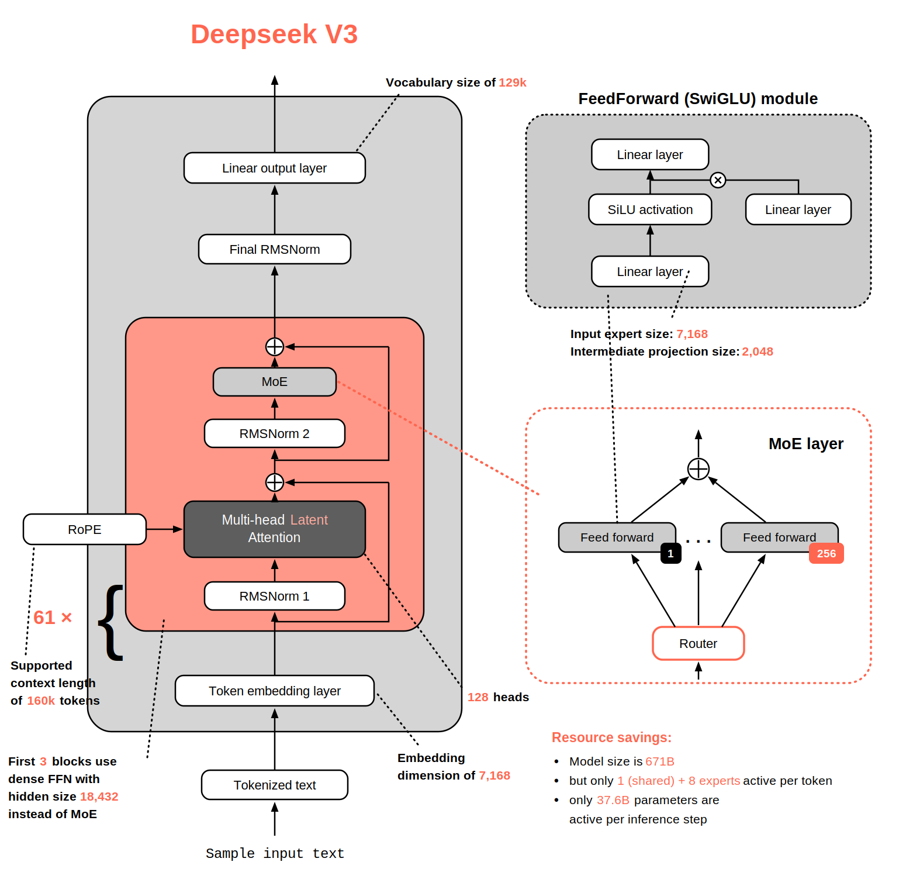
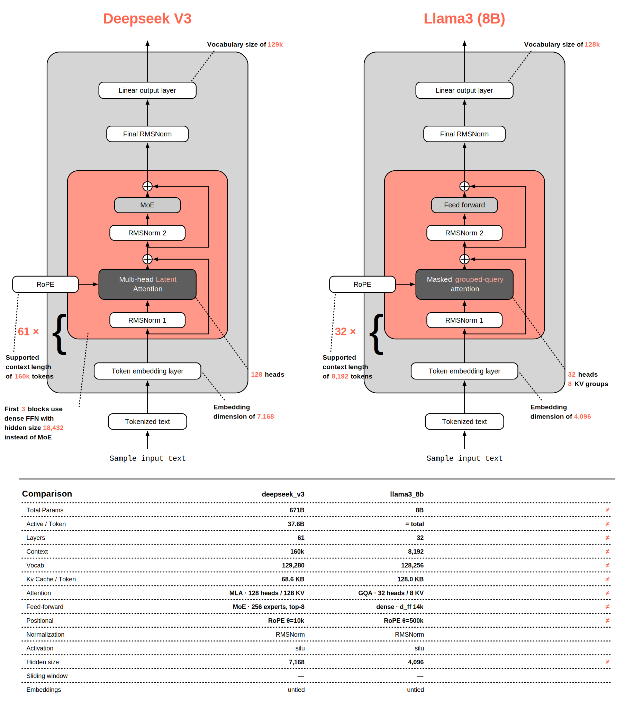

# llmviz

LLM architecture figures in the style of Sebastian Raschka's [LLM Architecture Gallery](https://sebastianraschka.com/llm-architecture-gallery/), generated from a HuggingFace `config.json` — no weights, no GPU, no `transformers` install. Bottom-up tower with nested containers, white pills, dark attention box, dotted-leader callouts carrying the key numbers, curly-brace layer repeat, FeedForward module inset, MoE layer inset with Router and expert cards, and Resource-savings bullets — parameter counts computed from the config itself. Each model family gets its own accent color, like the original figures.

Hand-drawn galleries update episodically. llmviz generates the same figure in milliseconds, for any model, the day it drops.



## Install

```bash
pip install llmviz            # SVG output
pip install "llmviz[png]"     # + PNG export via cairosvg
```

## Use

```bash
llmviz render deepseek-ai/DeepSeek-V3          # → DeepSeek-V3.svg
llmviz render Qwen/Qwen3-0.6B -o qwen.png      # PNG export
llmviz render ./config.json                    # local config file works too

llmviz diff deepseek-ai/DeepSeek-V3 NousResearch/Meta-Llama-3-8B   # side-by-side, differences flagged

llmviz gallery examples/models.yaml -o site/   # static HTML gallery with search + sort

llmviz inspect openai/gpt-oss-20b              # fact sheet as a terminal table

llmviz card deepseek-ai/DeepSeek-V3            # 1200x630 social card (PNG)
llmviz lineage meta-llama/Llama-2-7b-hf NousResearch/Meta-Llama-3-8B \
    -o evolution.svg                           # family evolution strip, changes flagged
llmviz watch --n 12 -o site/                   # gallery of the Hub's trending models right now
llmviz gallery models.yaml --space user/name   # deploy the gallery to a free HF Space
llmviz render Qwen/Qwen3-0.6B --animate        # staggered build-up animation (SVG)

llmviz render ollama:deepseek-r1               # your LOCAL models — GGUF metadata, no weights read
llmviz inspect ./model-q4.gguf                 # any .gguf file or remote GGUF URL (ranged fetch)
llmviz fit Qwen/Qwen3-235B-A22B -c 131072      # can I run it? fp16/q8/q4 VRAM + your GPU verdict
llmviz poster models.yaml --cols 6             # print-ready poster grid of towers
llmviz mcp                                     # MCP server: inspect/fit/render/diff as agent tools
llmviz explain zai-org/GLM-4.5-Air             # 5 LLM-written notes (local Ollama by default)
llmviz explain <model> --llm openai/local --api-base http://localhost:8080/v1   # llama.cpp
```

`watch` + `--space` on a cron is a self-updating public architecture gallery: every trending
model on the Hub, rendered the day it appears. `explain` needs `pip install llmviz[explain]` (LiteLLM) and defaults to local Ollama
(`ollama/llama3.2`, override with `--llm` or `LLMVIZ_LLM`) — any LiteLLM provider string works:
llama.cpp's OpenAI-compatible server, Groq, Gemini, Azure OpenAI, OpenRouter, Anthropic. Figures also include a KV-cache footprint table (per token and
at full context, fp16/fp8) computed from the same math as the parameter counts.

Gated repos (meta-llama, google) need `--token` or `hf auth login`; community mirrors usually host the identical config.



## What it reads from config.json

| Signal | Fields |
|---|---|
| MHA / GQA / MQA | `num_key_value_heads` vs `num_attention_heads` |
| MLA (DeepSeek) | `kv_lora_rank`, `q_lora_rank`, decoupled RoPE head dims |
| MoE | `num_experts`/`n_routed_experts`, `num_experts_per_tok`, shared experts, leading dense layers |
| Sliding window | `sliding_window`, `sliding_window_pattern`, `layer_types` (local:global ratios) |
| The rest | norm type, QK-norm, RoPE θ, tied embeddings, activation, context, vocab |

Parameter counts (total and active-per-token for MoE) are reconstructed from the per-layer math, not scraped from model cards. The test suite asserts them against published figures: GPT-2 124M, Llama-3-8B 8.03B, Qwen3-235B-A22B 235B/22B, DeepSeek-V3 671B/37.5B — all within 0.5–3%. KV-cache bytes per token come from the same math.

Counting convention: "active" means every parameter touched in a forward pass, including embeddings and the LM head. OpenAI reports gpt-oss-20b as 3.61B active by excluding the unembedding; llmviz reports 4.19B.

## Python API

```python
from llmviz.fetch import load_spec
from llmviz.render.block import render_model

spec = load_spec("Qwen/Qwen3-235B-A22B")
print(spec.total_params, spec.active_params, spec.attention.kind)
svg = render_model(spec)  # accent auto-assigned per family
```

`ArchSpec` is a Pydantic model, so `spec.model_dump_json()` gives you the normalized architecture as JSON for your own tooling.

## Any architecture, including tomorrow's

The parser is generic-first: wide field-name synonym coverage (`hidden_size`/`d_model`/`n_embd`, `num_experts`/`n_routed_experts`/`num_local_experts`, five spellings of top-k, …), capability detection instead of per-model code, and graceful degradation (missing vocab/context just drops that callout — it never crashes). Verified against a zoo that includes Kimi Linear (MLA + KDA hybrid + MoE), Qwen3-Next (gated-deltanet hybrid), Granite 4 (Mamba-2 hybrid), LFM2 (conv mixer), MiniMax-M1 (lightning attention), Falcon (`multi_query`/`alibi`/`parallel_attn`), OLMo 2 (post-norm), and Gemma (sandwich norm). Hybrid token mixers are summarized in a callout ("20 linear-attention (KDA) : 7 full attention layers") whichever of the five encodings the config uses.

Remaining limits: decoder-only LMs (encoder-decoder is out of scope), multimodal models render their text tower, and quirks invisible in `config.json` (QK-norm, default-tied embeddings, norm placement) live in a small per-family table that may need one line for a brand-new family.

## Development

```bash
python -m venv .venv && .venv/bin/pip install -e ".[dev,png]"
.venv/bin/pytest          # offline; fixtures are real Hub configs
.venv/bin/ruff check src tests && .venv/bin/black --check src tests
```

Apache-2.0.
